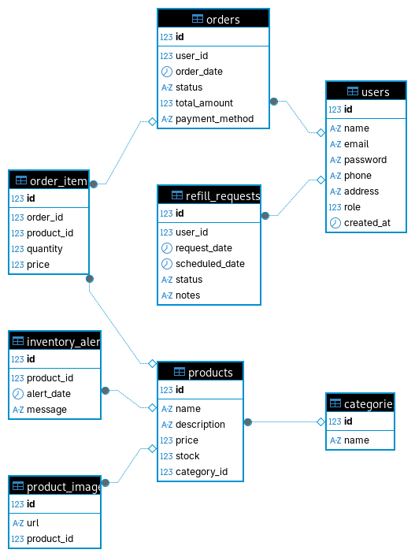

# FireX Hub

## Descripción General

FireX Hub es una plataforma integral de comercio y gestión de servicios para la venta y recarga de extintores. 
Permite a los clientes explorar el catálogo de productos, solicitar recargas, agendar recolección y entrega, realizar seguimiento a pedidos/servicios y descargar comprobantes. 
Incluye panel administrativo y funcionalidades para técnicos de campo.

Componentes del proyecto:
- Backend: API REST en Spring Boot (Java 21).
- Frontend: HTML5 + CSS3 + JavaScript (vanilla).
- Base de datos: MySQL.

---

## Integrantes del Equipo

| Nombre | Rol | Funcionalidad CRUD desarrollada |
|:----------------------|:------------------|:--------------------------------|
| Giovanny Ojeda    | Backend Developer | CRUD de Productos |
| Alejandro Santamaría | Backend Developer | CRUD de Categorías |
| Diego Fonseca     | Fullstack Developer | CRUD de Usuarios y Login |
| Todos los integrantes | Frontend | Maquetación y consumo de API |

---

## Tecnologías Implementadas

### Backend
- Java 21, Spring Boot 3.5.5  
- Spring Web, Spring Data JPA  
- MySQL 8  
- Lombok  
- Swagger / OpenAPI  
- Maven  

### Frontend (estático)
- HTML5 (páginas: index.html, catalogo.html, carrito.html, recarga.html, login.html, register.html, admin.html, solicitudes.html)  
- CSS3 (estilos en css/styles.css)  
- JavaScript (ES6) (lógica compartida en js/common.js)  
- Fetch API para consumir el backend  
- (Opcional) Live Server / python -m http.server / npx serve para servir estáticos

---

## Arquitectura General

```
FireX/
├── backend/                 # API REST - Spring Boot
│   ├── controllers/
│   ├── models/
│   ├── repositories/
│   ├── service/
│   └── FirexApplication.java
│
└── frontend/                # Sitio estático HTML + CSS + JS
    ├── css/
    │   └── styles.css
    ├── js/
    │   └── common.js
    ├── admin.html
    ├── carrito.html
    ├── catalogo.html
    ├── index.html
    ├── login.html
    ├── recarga.html
    ├── register.html
    └── solicitudes.html
```

---

## Diseño de Base de Datos

### Entidades Principales

| Entidad | Campos | Relaciones |
|:---------|:-------|:-----------|
| users | id, name, email, password, phone, address, role | — |
| categories | id, name | 1–N con products |
| products | id, name, description, price, stock, category_id | N–1 con categories |

### Diagrama Entidad–Relación (ERD)

```
USERS (id, name, email, password, phone, address, role)

CATEGORIES (id, name)

PRODUCTS (id, name, description, price, stock, category_id)
  category_id → CATEGORIES.id
```

---

## Funcionalidades Principales

### Autenticación
- Login mediante correo y contraseña.
- Validación de credenciales en backend.
- Retorno de datos del usuario autenticado.

### CRUDs Implementados

| Módulo | Descripción |
|:--------|:-------------|
| Usuarios | Crear, listar, editar y eliminar usuarios. |
| Productos | Gestión de catálogo (creación, listado, edición, eliminación). |
| Categorías | Administración de categorías y su asociación con productos. |

---

## Backend — Detalle Técnico

### Dependencias principales (pom.xml)
```xml
<dependencies>
  <dependency>
    <groupId>org.springframework.boot</groupId>
    <artifactId>spring-boot-starter-data-jpa</artifactId>
  </dependency>
  <dependency>
    <groupId>org.springframework.boot</groupId>
    <artifactId>spring-boot-starter-web</artifactId>
  </dependency>
  <dependency>
    <groupId>com.mysql</groupId>
    <artifactId>mysql-connector-j</artifactId>
    <scope>runtime</scope>
  </dependency>
  <dependency>
    <groupId>org.projectlombok</groupId>
    <artifactId>lombok</artifactId>
    <optional>true</optional>
  </dependency>
  <dependency>
    <groupId>org.springdoc</groupId>
    <artifactId>springdoc-openapi-starter-webmvc-ui</artifactId>
    <version>2.8.13</version>
  </dependency>
</dependencies>
```

### Controladores REST
- UserController.java — CRUD de usuarios + login  
- ProductoController.java — CRUD de productos  
- CategoriaController.java — CRUD de categorías

### Endpoints Principales

**Usuarios (/api/users)**
| Método | Endpoint | Descripción |
|:--|:--|:--|
| POST | /add | Crear usuario |
| GET | /all | Listar usuarios |
| GET | /{id} | Obtener usuario por ID |
| PUT | /update/{id} | Actualizar usuario |
| DELETE | /delete/{id} | Eliminar usuario |
| POST | /login | Iniciar sesión |

**Categorías (/categorias)**
| Método | Endpoint | Descripción |
|:--|:--|:--|
| GET | /list | Listar categorías |
| GET | /list/{id} | Buscar por ID |
| POST | / | Crear categoría |
| PUT | / | Editar categoría |
| DELETE | /{id} | Eliminar categoría |

**Productos (/productos)**
| Método | Endpoint | Descripción |
|:--|:--|:--|
| GET | /list | Listar productos |
| GET | /list/{id} | Buscar producto por ID |
| POST | / | Crear producto |
| PUT | / | Editar producto |
| DELETE | /{id} | Eliminar producto |

### Configuración de Base de Datos
Editar backend/src/main/resources/application.properties:
```properties
spring.datasource.url=jdbc:mysql://localhost:3306/tienda_db?useSSL=false
spring.datasource.username=root
spring.datasource.password=TU_CONTRASEÑA
spring.jpa.hibernate.ddl-auto=update
server.port=8066
```

### Diagrama de la base de datos



---

## Frontend — Detalle Técnico (HTML + CSS + JS)

### Estructura
- Páginas: index.html, catalogo.html, carrito.html, recarga.html, login.html, register.html, admin.html, solicitudes.html  
- Estilos: css/styles.css  
- Lógica: js/common.js

### Consumo de la API (Fetch)
Ejemplo:
```js
const API_BASE = "http://localhost:8066";

async function listarProductos() {
  const res = await fetch(`${API_BASE}/productos/list`);
  if (!res.ok) throw new Error("Error al listar productos");
  return res.json();
}
```

---

## Ejecución del Proyecto

### 1. Clonar el repositorio
```bash
git clone https://github.com/<usuario>/firex.git
cd firex
```

### 2. Iniciar el Backend
```bash
cd backend
mvn clean install
mvn spring-boot:run
```
Disponible en http://localhost:8066

### 3. Servir el Frontend
```bash
cd frontend
python -m http.server 5173
```
Navegar a http://localhost:5173

---

## Pruebas

Backend:
```bash
mvn test
```

---

## Documentación de la API
Swagger UI:  
http://localhost:8066/swagger-ui/index.html

---

## Evidencias
1. Login de usuario funcional  
2. CRUD de productos y categorías  
3. Base de datos con datos persistentes  
4. Navegación correcta entre páginas HTML  

---

## Mejoras Futuras
- Autenticación JWT  
- Validaciones con @Valid  
- Paginación y búsqueda  
- Subida de imágenes  
- Roles (Admin, Cliente, Técnico)  
- Dashboard con métricas  

